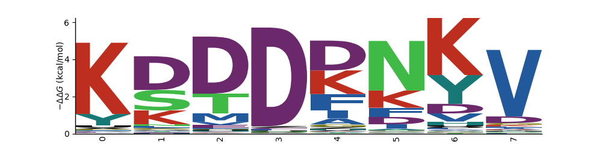
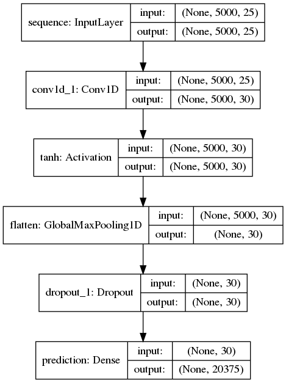

# biocompress

A cute experiment to "learn" a compression language for proteins

An example of a 2 ML trained linear epitopes :

The core idea behind this architecture is super simple. A 1-D convolutional layer with a small number of filters is used to "learn" linear epitopes on every protein in the proteome. (From SwissProt). A global max pooling layer squeezes this output into a short binary vector, indicating whether or not that "virtual antibody" bound anywhere in that proteins sequence. The classification stage uses a softmax layer to "call" which protein is most likely.

Amazingly, it converges quite well.

Bash one-liner to find amino acid frequency accross SwissProt database

cat uniprot_sprot.fasta | egrep -v '^>' | awk -vFS="" '{for(i=1;i<=NF;i++)w[$i]++}END{for(i in w) print i,w[i]}' | sort -rg -k2

results : (25) 

	L 19580028
	A 16749722
	G 14358341
	V 13920262
	E 13645819
	S 13457567
	I 12004988
	K 11782421
	R 11221667
	D 11077521
	T 10862611
	P 9607840
	N 8232829
	Q 7974951
	F 7841538
	Y 5921976
	M 4896983
	H 4616892
	C 2805271
	W 2230693
	X 8262
	U 329
	B 277
	Z 249
	O 29
